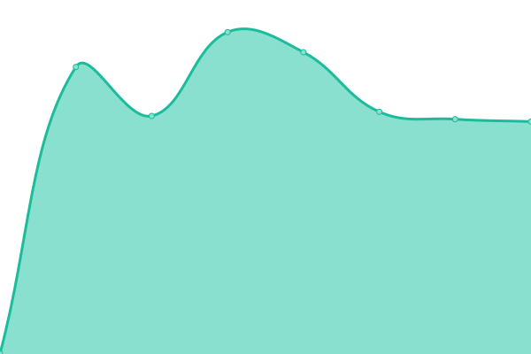

# [📈 Live Status](https://ggoban.github.io/upptime): <!--live status--> **🟧 Partial outage**

This repository contains the open-source uptime monitor and status page for [ggoban](http://www.ggoban.com), powered by [Upptime](https://github.com/upptime/upptime).

With [Upptime](https://upptime.js.org), you can get your own unlimited and free uptime monitor and status page, powered entirely by a GitHub repository. We use [Issues](https://github.com/ggoban/upptime/issues) as incident reports, [Actions](https://github.com/ggoban/upptime/actions) as uptime monitors, and [Pages](https://ggoban.github.io/upptime) for the status page.

<!--start: status pages-->
<!-- This summary is generated by Upptime (https://github.com/upptime/upptime) -->
<!-- Do not edit this manually, your changes will be overwritten -->
<!-- prettier-ignore -->
| URL | Status | History | Response Time | Uptime |
| --- | ------ | ------- | ------------- | ------ |
|  [kobic](https://www.kobic.re.kr) | 🟩 Up | [kobic.yml](https://github.com/ggoban/upptime/commits/HEAD/history/kobic.yml) | 

 1942ms
     
 | 

<a href="https://ggoban.github.io/upptime/history/kobic">100.00%</a>
    

|  [kobis](https://www.kobis.re.kr) | 🟥 Down | [kobis.yml](https://github.com/ggoban/upptime/commits/HEAD/history/kobis.yml) | 

 0ms
     
 | 

<a href="https://ggoban.github.io/upptime/history/kobis">0.00%</a>
    

|  [biodata](https://www.biodata.kr) | 🟥 Down | [biodata.yml](https://github.com/ggoban/upptime/commits/HEAD/history/biodata.yml) | 

 0ms
     
 | 

<a href="https://ggoban.github.io/upptime/history/biodata">0.00%</a>
    

|  [bioexpress](https://www.bioexpress.re.kr) | 🟩 Up | [bioexpress.yml](https://github.com/ggoban/upptime/commits/HEAD/history/bioexpress.yml) | 

 2045ms
     
 | 

<a href="https://ggoban.github.io/upptime/history/bioexpress">100.00%</a>
    

|  [ginet](https://ginet.kr) | 🟥 Down | [ginet.yml](https://github.com/ggoban/upptime/commits/HEAD/history/ginet.yml) | 

 0ms
     
 | 

<a href="https://ggoban.github.io/upptime/history/ginet">0.00%</a>
    

<!--end: status pages-->

[**Visit our status website →**](https://ggoban.github.io/upptime)

## 📄 License

- Powered by: [Upptime](https://github.com/upptime/upptime)
- Code: [MIT](./LICENSE) © [ggoban](http://www.ggoban.com)
- Data in the `./history` directory: [Open Database License](https://opendatacommons.org/licenses/odbl/1-0/)
